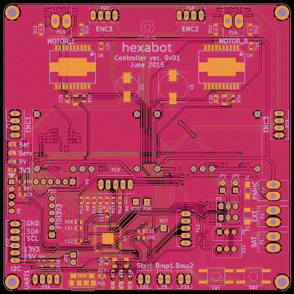

Hexabot Sources
===============

Design files and source code of a mobile robot for the [Eurobot competition](http://www.eurobot.org/).

The controller board is built in [KiCad](http://www.kicad-pcb.org/)
around a [dsPIC33EP256MU806](https://www.microchip.com/products/dsPIC33EP256MU806) (QFN, motor control, USB).
You can control it from your development machine or an embedded Linux like the Raspberry Pi (raspbian jessie recommended).

Controller PCB
--------------
The board handles various functions: motor control, odometry, sensors and servomotors.
It has two layers, 10cm*10cm and mostly 0806 SMT components.

You can buy 10 PCBs for 32$ at [SeeedStudio](http://www.seeedstudio.com/service/index.php?r=pcb).
Then we hand-soldered ours.



Embedded Software
-----------------
The source code for the microcontroller is in [hexabot-dsPIC33.X](hexabot-dsPIC33.X/).
It is controlled with the tools in [linux](linux/). Most are Python scripts that
use [PyUSB](https://walac.github.io/pyusb/) to communicate with the board through independant USB endpoints:
- Bulk commands to set parameters and read back values. The basic idea is to run `./command.py <register> <value>` to set a value.
- Bulk metrics broadcasting, isochronous packets for time-sensitive data. Dump them with `./usb_controller.py`.
- Serial port for debugging. Show the debug console with `miniterm.py /dev/ttyACM* 9600 -D`.

A higher level scripts like `joystick.py` uses the command endpoint to let you control the motors with a USB joystick.

User Interface
--------------
The [ui](ui/) directory contains a Python webserver with these features:
- live updates of the position according to odometry,
- graphs to visualize metrics,
- maybe someday a way to send commands.

Setup
-----
Download and install the [MPLABX IDE](http://www.microchip.com/mplabx/) and the [XC16 compiler](http://www.microchip.com/compilers/).
You need xc16 v1.25+ because of bug XC16-781 (snprintf).
Sadly the peripheral libraries were last shipped with v1.24 and the new Code Configurator doesn't support dsPIC33E yet.
You need to copy the libraries from one installed version to the other.

Install Python 3 and debugging tools like Wireshark.
For Ubuntu 15.04 you can run:
```bash
git clone https://github.com/Caerbannog/hexabot.git
sudo apt-get install python3-pip wireshark
sudo pip3 install pyusb==1.0.0b1 autobahn==0.10.4 pyinotify==0.9.6 bottle==0.12.8
sudo adduser $USER dialout
sudo adduser $USER wireshark
echo usbmon | sudo tee -a /etc/modules
sudo cp 99-hexabot.rules /etc/udev/rules.d/
sudo pip install miniterm.py
```

Contributing
------------
Pull requests are welcome on the project page:
<https://github.com/Caerbannog/hexabot>

Licenses
--------
- Hardware design files are published under the CERN OHL v.1.2.
- Source code is published under the GPLv3 or later.
- Note that Microchip's USB library and the CDC-basic demo have a more restrictive license.

TODO list
---------
- Documentation for the code. Links to documentation for the motor control and odometry.
